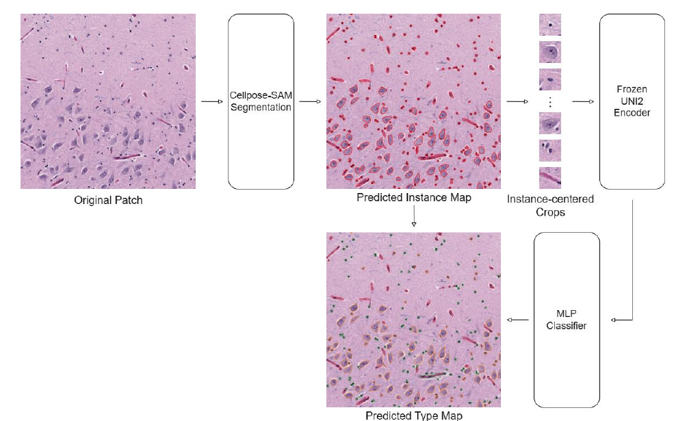
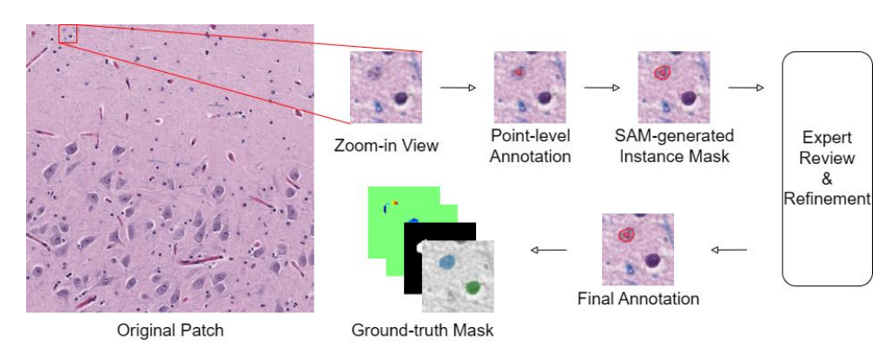
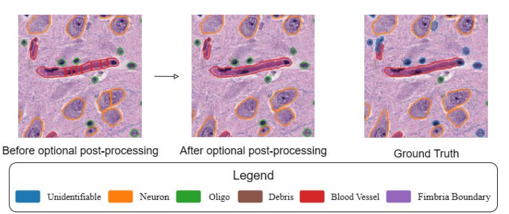
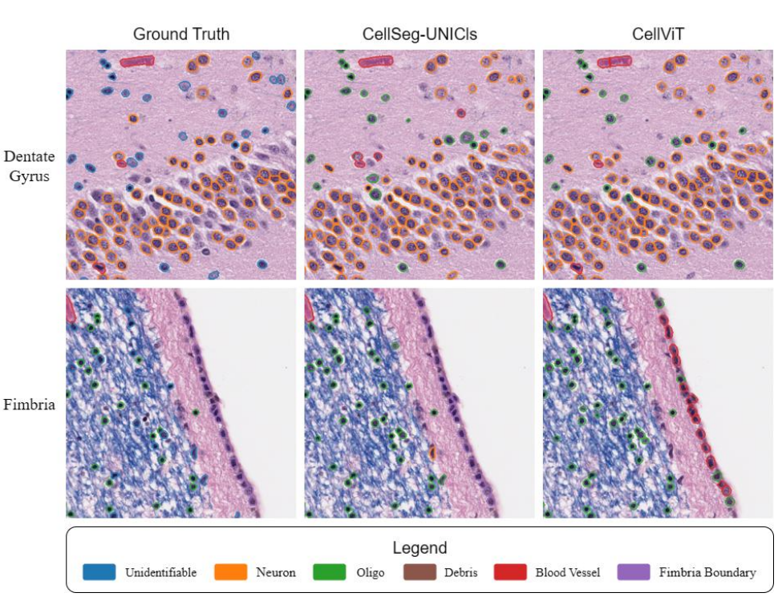

# CellSeg-UNICls: Decoupled Segmentation and Embedding-based Cell Classification for Brain Histopathology

<p align="center">
  
</p>


<p align="center">
  
  
  
  
  
</p>


This repository contains the implementation of **CellSeg-UNICls**, a decoupled framework for cell-level instance segmentation and cell type classification in brain histopathology images under limited annotation conditions.

The framework combines:

1. **Point-guided SAM-assisted annotation** for efficient cell-level mask generation.
2. **Cellpose-SAM-based instance segmentation** for robust cell boundary delineation.
3. **UNI2 embedding-based classification** using a lightweight MLP classifier for semantic cell type prediction.
4. **Patient-wise evaluation** using Dice, bPQ, mPQ, detection F1, weighted classification F1, and macro classification F1.

> This project was developed for Hongrui Zhu's M.S. thesis: *CellSeg-UNICls: Decoupled Segmentation and Embedding-based Cell Classification for Brain Histopathology*.

---

## Table of Contents

- [Overview](#overview)
- [Key Features](#key-features)
- [Workflow](#workflow)
- [Dataset](#dataset)
- [Annotation Workflow](#annotation-workflow)
- [Method](#method)
- [Repository Structure](#repository-structure)
- [Installation](#installation)
- [Data Preparation](#data-preparation)
- [Training](#training)
- [Inference](#inference)
- [Evaluation](#evaluation)
- [Results](#results)
- [Important Notes](#important-notes)
- [Citation](#citation)
- [Acknowledgements](#acknowledgements)
- [License](#license)

---

## Overview

Cell-level analysis in brain histopathology is challenging because dense instance-level annotations are expensive, labeled brain tissue datasets are limited, and models trained on tumor or epithelial histology may not generalize well to neural tissue.

**CellSeg-UNICls** addresses these challenges with a modular two-stage design:

- **Stage 1: Instance segmentation**  
  A Cellpose-SAM segmentation backbone detects and delineates individual cell instances.

- **Stage 2: Instance-centered classification**  
  Each predicted instance is cropped from the original RGB image, resized to the UNI2 input resolution, encoded by a frozen UNI2 encoder, and classified by a lightweight MLP.

This decoupled design allows the segmentation and classification components to be optimized independently, which is especially useful when dense annotations and class labels are limited.

---

## Key Features

- Brain histopathology-focused cell segmentation and classification pipeline.
- Point-guided SAM-assisted annotation workflow.
- Decoupled segmentation and classification design.
- Frozen UNI2 feature extractor with lightweight MLP classifier.
- Support for patient-wise evaluation to avoid patient-level data leakage.
- Evaluation using segmentation, detection, and classification metrics.
- Optional morphology-aware post-processing analysis for over-segmentation correction.

---

## Workflow

The overall pipeline is shown below.

<p align="center">
  
</p>


The pipeline follows these steps:

1. Input a 1024 x 1024 histopathology image patch.
2. Predict cell instances using Cellpose-SAM.
3. Extract instance-centered RGB crops from the original image.
4. Resize each crop to 224 x 224.
5. Extract a 1536-dimensional UNI2 embedding for each instance.
6. Classify each instance with a lightweight MLP classifier.
7. Generate the final instance map and cell type map.

---

## Dataset

The dataset used in this project was curated from the **NYBB brain slide collection**. It covers multiple anatomical regions and disease conditions.

### Dataset Summary

<div align="center">

| Item                      | Description                        |
| ------------------------- | ---------------------------------- |
| Source                    | NYBB brain slide collection        |
| Disease groups            | AD-only, AD+LBD, non-AD            |
| Number of subjects        | 6                                  |
| Brain regions             | CA1, CA2/3, fimbria, dentate gyrus |
| Patches per subject       | 8                                  |
| Total patches             | 48                                 |
| Patch size                | 1024 x 1024                        |
| Total annotated instances | 13,697                             |
   
</div>


### Cell Categories

<div align="center"> 

| Label            | Description                                              | Used for Classification? |
| ---------------- | -------------------------------------------------------- | ------------------------ |
| Neuron           | Major neuronal cell body class                           | Yes                      |
| Oligo            | Oligodendrocyte-like cells                               | Yes                      |
| Blood vessel     | Blood vessel regions or vascular structures              | Yes                      |
| Debris           | Very small dark-stained artifacts or fragments           | Yes                      |
| Fimbria boundary | Region-specific boundary structures in fimbria           | Yes                      |
| Unidentifiable   | Ambiguous structures that cannot be confidently assigned | No                       |

</div>


`Unidentifiable` instances are included during annotation to reduce forced labeling noise, but they are excluded from classification training and classification metric computation.

### Recommended Data Layout

```text
data/
├── raw/
│   ├── images/
│   │   ├── patient_001_CA1_01.png
│   │   ├── patient_001_CA1_02.png
│   │   └── ...
│   └── annotations/
│       ├── patient_001_CA1_01.geojson
│       ├── patient_001_CA1_02.geojson
│       └── ...
├── processed/
│   ├── images/
│   ├── masks/
│   ├── instance_maps/
│   ├── type_maps/
│   └── metadata.csv
└── splits/
    ├── fold_1_train.txt
    ├── fold_1_test.txt
    └── ...
```

> The raw NYBB images and annotations may be subject to data-use restrictions. Do not upload private or restricted data to a public GitHub repository unless you have permission.

---

## Annotation Workflow

This project uses a point-guided SAM-assisted annotation workflow to reduce the cost of dense instance-level labeling.

<p align="center">
  
</p>


The annotation process contains three stages:

1. **Point-based initialization**  
   Annotators mark approximate cell centers and assign preliminary labels in QuPath.

2. **SAM-based instance generation**  
   The annotated points are used as prompts for SAM to generate instance masks.

3. **Expert review and refinement**  
   Generated masks and labels are manually reviewed and corrected to produce final cell-level annotations.

---

## Method

### 1. Instance Segmentation

Cellpose-SAM is used as the segmentation backbone. The segmentation model predicts foreground cell instances without directly assigning cell type labels.

Default training setting used in the thesis:

<div align="center">

| Parameter     |                 Value |
| :-------------: | :--------------------: |
| Backbone      |          Cellpose-SAM |
| Epochs        |                   100 |
| Batch size    |                     4 |
| Learning rate |                  1e-5 |
| Weight decay  |                   0.1 |
| GPU           | NVIDIA RTX A6000 48GB |
   
</div>


### 2. Instance-centered Crop Extraction

For each predicted instance, the centroid is computed and used as the crop center. A local RGB patch is extracted from the original image.

Default final setting:

<div align="center">

| Parameter       |                                Value |
| :---------------: | :-----------------------------------: |
| Crop size       |                              64 x 64 |
| UNI2 input size |                            224 x 224 |
| Padding         | Black padding for out-of-bound crops |

</div>

### 3. UNI2 Embedding Extraction

Each instance-centered crop is resized to 224 x 224 and passed into a frozen UNI2 encoder. The encoder outputs a 1536-dimensional feature vector.

```text
RGB crop -> resize to 224 x 224 -> frozen UNI2 encoder -> 1536-d embedding
```

The UNI2 encoder remains frozen during classifier training to reduce overfitting under limited data.

### 4. MLP Classifier

A lightweight MLP classifier predicts the semantic cell type from the UNI2 embedding.

```text
1536 -> 512 -> 128 -> 32 -> C
```

where `C` is the number of output semantic classes. ReLU activation and dropout are applied after hidden layers.

Default classifier training setting:

<div align="center">

| Parameter     |                          Value |
| :-------------: | :-----------------------------: |
| Optimizer     |                          AdamW |
| Epochs        |                            100 |
| Batch size    |                             32 |
| Learning rate |                           1e-3 |
| Weight decay  |                              0 |
| Loss          | Cross-entropy with ignore mask |
| Ignored label |                 Unidentifiable |

</div>
   
### 5. Optional Morphology-aware Post-processing

An optional post-processing strategy was explored to merge nearby same-class fragments for neurons and blood vessel regions.

<p align="center">
  
</p>


This step is **not included in the final CellSeg-UNICls pipeline** because the selected Cellpose-SAM segmentation backbone already produces limited over-segmentation, and fixed dilation-based merging may over-merge nearby independent instances in dense regions.

---

## Repository Structure

A recommended repository structure is shown below. If your implementation uses different script names, keep the same logic and update the command paths accordingly.

```text
CellSeg-UNICls/
├── README.md
├── requirements.txt
├── LICENSE
├── configs/
│   ├── segmentation.yaml
│   ├── classification.yaml
│   └── evaluation.yaml
├── data/
│   ├── raw/                 # Not tracked by Git
│   ├── processed/           # Not tracked by Git
│   └── splits/
├── docs/
│   └── figures/
│       ├── annotation_workflow.png
│       ├── pipeline_overview.png
│       ├── post_processing.png
│       └── qualitative_results.png
├── scripts/
│   ├── prepare_dataset.py
│   ├── train_cellpose_sam.py
│   ├── extract_instance_crops.py
│   ├── extract_uni2_embeddings.py
│   ├── train_classifier.py
│   ├── infer.py
│   └── evaluate.py
├── src/
│   ├── data/
│   │   ├── dataset.py
│   │   ├── transforms.py
│   │   └── splits.py
│   ├── segmentation/
│   │   ├── cellpose_sam_train.py
│   │   └── postprocess.py
│   ├── classification/
│   │   ├── crop_extractor.py
│   │   ├── uni2_encoder.py
│   │   └── mlp_classifier.py
│   ├── evaluation/
│   │   ├── metrics.py
│   │   ├── matching.py
│   │   └── visualize.py
│   └── utils/
│       ├── io.py
│       └── seed.py
├── outputs/
│   ├── predictions/
│   ├── checkpoints/
│   ├── embeddings/
│   └── figures/
└── notebooks/
    ├── dataset_exploration.ipynb
    └── qualitative_visualization.ipynb
```

Recommended `.gitignore` entries:

```text
data/raw/
data/processed/
outputs/checkpoints/
outputs/embeddings/
outputs/predictions/
*.pth
*.pt
*.ckpt
*.npy
*.npz
__pycache__/
.ipynb_checkpoints/
```

---

## Installation

### 1. Clone the Repository

```bash
git clone https://github.com/BlackOrnate/CellSeg-UNICls.git
cd CellSeg-UNICls
```

### 2. Create a Conda Environment

```bash
conda create -n cellseg-unicls python=3.10 -y
conda activate cellseg-unicls
```

### 3. Install Dependencies

```bash
pip install -r requirements.txt
```

A typical `requirements.txt` may include:

```text
torch
torchvision
numpy
pandas
scikit-image
scikit-learn
opencv-python
matplotlib
tqdm
pyyaml
Pillow
cellpose
```

Depending on how UNI2 is loaded in your implementation, you may also need packages such as `timm`, `transformers`, or related model-loading utilities.

---

## Data Preparation

Convert raw image patches and annotation files into the processed format used by the training and evaluation scripts.

```bash
python scripts/prepare_dataset.py \
  --image_dir data/raw/images \
  --annotation_dir data/raw/annotations \
  --output_dir data/processed
```

Create patient-wise leave-one-patient-out splits:

```bash
python scripts/create_splits.py \
  --metadata data/processed/metadata.csv \
  --output_dir data/splits \
  --split_type leave_one_patient_out
```

Expected processed outputs:

```text
data/processed/
├── images/          # RGB image patches
├── instance_maps/   # Instance ID maps
├── type_maps/       # Semantic type maps
└── metadata.csv     # Patient ID, region, disease group, file names
```

---

## Training

### 1. Train Cellpose-SAM Segmentation

```bash
python scripts/train_cellpose_sam.py \
  --data_dir data/processed \
  --split_file data/splits/fold_1_train.txt \
  --epochs 100 \
  --batch_size 4 \
  --lr 1e-5 \
  --weight_decay 0.1 \
  --output_dir outputs/checkpoints/segmentation
```

### 2. Generate Segmentation Predictions

```bash
python scripts/infer_segmentation.py \
  --image_dir data/processed/images \
  --checkpoint outputs/checkpoints/segmentation/best_model.pth \
  --output_dir outputs/predictions/instances
```

### 3. Extract Instance-centered Crops

```bash
python scripts/extract_instance_crops.py \
  --image_dir data/processed/images \
  --instance_dir outputs/predictions/instances \
  --crop_size 64 \
  --output_dir outputs/crops
```

### 4. Extract UNI2 Embeddings

```bash
python scripts/extract_uni2_embeddings.py \
  --crop_dir outputs/crops \
  --resize 224 \
  --output_dir outputs/embeddings/uni2
```

### 5. Train the MLP Classifier

```bash
python scripts/train_classifier.py \
  --embedding_dir outputs/embeddings/uni2 \
  --metadata data/processed/metadata.csv \
  --split_file data/splits/fold_1_train.txt \
  --epochs 100 \
  --batch_size 32 \
  --lr 1e-3 \
  --ignore_label unidentifiable \
  --output_dir outputs/checkpoints/classification
```

---

## Inference

Run the full CellSeg-UNICls pipeline on a new image patch:

```bash
python scripts/infer.py \
  --image_path data/processed/images/example_patch.png \
  --seg_checkpoint outputs/checkpoints/segmentation/best_model.pth \
  --cls_checkpoint outputs/checkpoints/classification/best_model.pth \
  --crop_size 64 \
  --resize 224 \
  --output_dir outputs/predictions/example_patch
```

Expected outputs:

```text
outputs/predictions/example_patch/
├── instance_map.png
├── type_map.png
├── overlay.png
└── predictions.csv
```

---

## Evaluation

Evaluate segmentation, detection, and classification performance:

```bash
python scripts/evaluate.py \
  --pred_instance_dir outputs/predictions/instances \
  --pred_type_dir outputs/predictions/types \
  --gt_instance_dir data/processed/instance_maps \
  --gt_type_dir data/processed/type_maps \
  --pairing_radius 12 \
  --exclude_label unidentifiable \
  --output_dir outputs/evaluation
```

### Metrics

<div align="center">
   
|             Metric            | Purpose                                                      |
| :-----------------------------: | :------------------------------------------------------------: |
| Dice                          | Foreground mask overlap                                      |
| bPQ                           | Binary panoptic quality for foreground-background segmentation |
| mPQ                           | Multi-class panoptic quality                                 |
| F1 (Detection)                | Instance detection performance                               |
| F1 (Classification, Weighted) | Classification F1 weighted by class frequency                |
| F1 (Classification, Macro)    | Class-balanced classification F1                             |

</div>

Classification metrics are computed only on paired predicted and ground-truth instances. Unpaired predictions affect detection and panoptic metrics, but they are not included in classification F1 computation.

---

## Results

### Overall Quantitative Results

<div align="center">

|           Model            |    Dice    |    bPQ     |    mPQ     |  F1(Det)   | F1(Cls, W) | F1(Cls, M) |
| :------------------------: | :--------: | :--------: | :--------: | :--------: | :--------: | :--------: |
|      CellViT (SAM-H)       |   0.8154   |   0.6529   |   0.4061   |   0.7898   |   0.9356   |   0.4766   |
|     CellViT++ (SAM-H)      |   0.8154   |   0.6529   |   0.2848   |   0.7898   |   0.6057   |   0.2895   |
|        PointFormer         |   0.8074   |   0.5939   |   0.3064   |   0.7816   |   0.8593   |   0.6766   |
|        Cellpose-SAM        | **0.8633** | **0.7834** |     -      | **0.8700** |     -      |     -      |
| Cellpose-SAM + CellViT cls | **0.8633** | **0.7834** |   0.5266   | **0.8700** | **0.9394** |   0.5740   |
|   CellSeg-UNICls (ours)    | **0.8633** | **0.7834** | **0.5548** | **0.8700** |   0.9326   | **0.7472** |

</div>

The proposed method preserves the strong segmentation performance of Cellpose-SAM while improving class-aware panoptic quality and macro classification F1.

### Qualitative Results

<p align="center">
  
</p>


In representative dentate gyrus and fimbria regions, CellSeg-UNICls provides clear instance-level delineation and more balanced class predictions, especially for minority or region-specific categories such as fimbria boundary cells.

### Per-class Performance

<div align="center">

|           Model            |    Neuron  |    Oligo   |    Debris  |  Blood vessel  | Fimbria boundary |
| :------------------------: | :--------: | :--------: | :--------: | :--------: | :--------: |
|      CellViT (SAM-H)       |   0.6110   |   0.4422   |   0.0000   |      0.3621    |      0.0000      |
|     CellViT++ (SAM-H)      |   0.1491   |   0.3881   |   0.0000   |      0.4238    |      0.0000      |
|        PointFormer         |   0.4165   |   0.3426   |   0.0000   |      0.2694    |      0.2408      |
| Cellpose-SAM + CellViT cls |   0.6693   |   0.5430   |   0.0000   |    **0.5764**  |      0.0000      |
|   CellSeg-UNICls (ours)    | **0.6802** | **0.5645** |   0.0000   |      0.5669    |    **0.7565**    |

</div>


The proposed method achieves the best mPQ performance for neurons, oligo, and fimbria boundary cells, while remaining competitive for blood vessel regions.

---

## Important Notes

- The dataset is not included in this repository by default.
- Raw pathology images and annotations should not be uploaded publicly unless permitted by the data owner.
- Trained model weights are not included by default. If released, place them under `outputs/checkpoints/` or provide a download link.
- `Unidentifiable` is used during annotation but excluded from classification training and classification metrics.
- The optional morphology-aware post-processing module is provided for ablation analysis and is not part of the final pipeline.
- Script names in this README can be adjusted to match your actual codebase.

---

## Citation

If you find this project useful, please cite:

```bibtex
@mastersthesis{zhu2026cellsegunicls,
  title  = {CellSeg-UNICls: Decoupled Segmentation and Embedding-based Cell Classification for Brain Histopathology},
  author = {Zhu, Hongrui},
  school = {Stony Brook University},
  year   = {2026},
  type   = {Master's Thesis}
}
```

---

## Acknowledgements

This project builds on several important tools and models, including Cellpose, Segment Anything, Cellpose-SAM, UNI2, QuPath, PyTorch, and common scientific Python libraries.

---

## License

Please add a `LICENSE` file before making the repository public.

Recommended options:

- Use an open-source license such as MIT or Apache-2.0 for code if you want others to reuse it.
- Keep dataset files, private annotations, and restricted pathology images excluded from the license unless you have explicit permission to release them.
